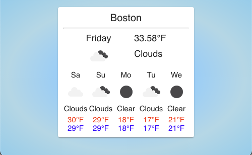

# OpenWeatherApp Demo

This project was built using React + Typescript to fetch API data from the OpenWeatherAPP API

# Instructions

To build, an Api URL and Key must be created from the OpenWeatherApp website

# To DO

If given more time, I would properly implement Types and refactor my components out of the App file with UseContext
